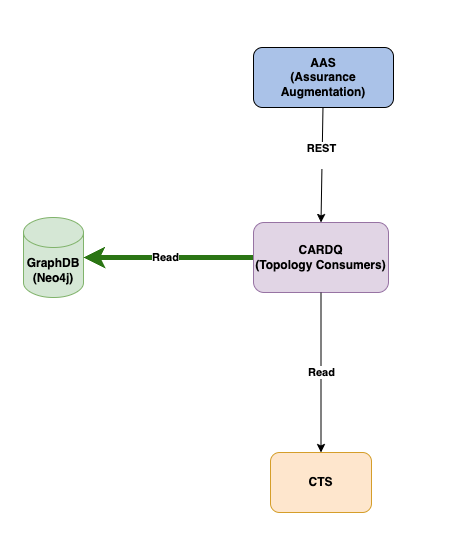

<!--Document information:
Prepared:Team Vibranium
Approved:
Document Name:application-developers-guide
Revision: {!.bob/var.application-developers-guide-version!}
Date: {!.bob/var.date!}
-->

# *Core Analytics Reporting Dimensioning Query* Application Developers Guide

[TOC]

## Introduction

This user guide gives a brief description of the main features and interfaces of the Core Analytics Reporting Dimensioning Query (CARDQ)
micro-service.

CARDQ is introduced for the purpose of querying topology information from the Common Topology Service (CTS) to aggregate performance metrics (PM) counters for 5G core slices and 5G RAN slices.

For 5G core slices, performance metrics (PM) counters are aggregated from NSI, NSSI, GeographicSite and PlmnId of the Common Topology Service (CTS).

For 5G RAN slices, performance metrics (PM) counters are aggregated from NSI, NSSI, QoS(5QI), NRCell(tac, cellId), PLMNInfo(Snssai, PlmnId) of the Common Topology Service (CTS).

CARDQ acts as an augmentation information provider to add slice data from CTS to PM counter records augmented by the Assurance Augmentation Service
(AAS).  It also has the capability to query topology data from Neo4j (neo4j-graphdb). This alternative responds faster and scales better than using CTS as the data source.

CARDQ supports integration with the PM Server to provide metrics and the log transformer service for supplying logs.

CARDQ supports integration with SIP-TLS to enable cluster-internal secured communication with server and client authentication based on TLS. CARDQ securely communicates with AAS, CTS, PM server and the log transformer using SIP-TLS when their respective TLS setting is enabled.

### Revision History

| Date       | Revision | Comment                                                                   | Author  |
|------------|----------|---------------------------------------------------------------------------|---------|
| 2022-12-22 | 1.0.0    | Initial documentation                                                     | eptamua |
| 2023-05-30 | 1.0.1    | BAM Integration                                                           | ebobpat |
| 2023-06-27 | 1.0.2    | SIP-TLS support                                                           | zkauhar |
| 2023-08-24 | 1.0.3    | Refactor OpenAPI spec to returns arrays of name-value pairs               | eptamua |
| 2023-12-27 | 1.0.4    | Support Aggregation by Site and NSSI without EntityCollection - Core Only | zkauhar |
| 2024-01-03 | 1.0.5    | Refactor Application Developers Guide - include RAN augmentationFields    | zsrigol |
| 2024-05-16 | 1.0.6    | CARDQ ATH Integration - Part 1                                            | euniwle |


## Application Integration



The diagram shows the CARDQ micro-service in the context of its application and external dependencies.

The flow during regular operation is as follows:

* AAS performs a REST call to the CARDQ service including the network function identifier and S-NSSAI for
  augmenting the PM data gathered from Core Network Functions.
* The CARDQ service uses the CTS to query topology information as well as explore and gather the related data with the provided network function
  identifier.
* The received topology information from the CTS enables CARDQ to determine what NSI, NSSI, GeographicSite and PlmnId to send to the AAS.
* Alternatively, CARDQ can access topology information through Neo4j.

## Augmentation API Endpoint

**Primary Endpoint**

The endpoint `/v1/augmentation-info/augmentation` is primarily responsible for augmenting slice data from CTS or Neo4j to the PM counter records of the 5G
core slices.

In the request body:

* Fields used to find the topologically related entities are passed as `inputFields`.
* Fields being requested from AAS for performing augmentation are passed as `augmentationFields`.

This endpoint will return a response body containing an array of unique sets of pairs of the augmentation field name and corresponding value as
follows:

```json
{
  "fields": [
    [
      {
        "name": "nsi",
        "value": "ManualDataSet-NetworkSlice-B"
      },
      {
        "name": "nssi",
        "value": "NetworkSliceSubnet:NSSI-A11"
      },
      {
        "name": "site",
        "value": "GeographicSite:DataCenter1"
      },
      {
        "name": "plmnId",
        "value": "100-101"
      }
    ]
  ]
}
```

**Secondary Endpoint**

The endpoint `v1/augmentation-info/augmentation/query/types` is responsible for retrieving the types of dimensioning
queries that a given ARDQ implementation, such as CARDQ, can support.  Assuming both Core and RAN are currently supported,
this GET endpoint will return a response body similar to the following:

```json
[
  {
    "queryType": "core"
  },
  {
    "queryType": "ran"
  }
]
```

See **API Documentation** for more information .

## Appendix

* [CARDQ Gerrit Repo](https://gerrit-gamma.gic.ericsson.se/#/admin/projects/OSS/com.ericsson.oss.air/eric-oss-core-reporting-dimension-query)
