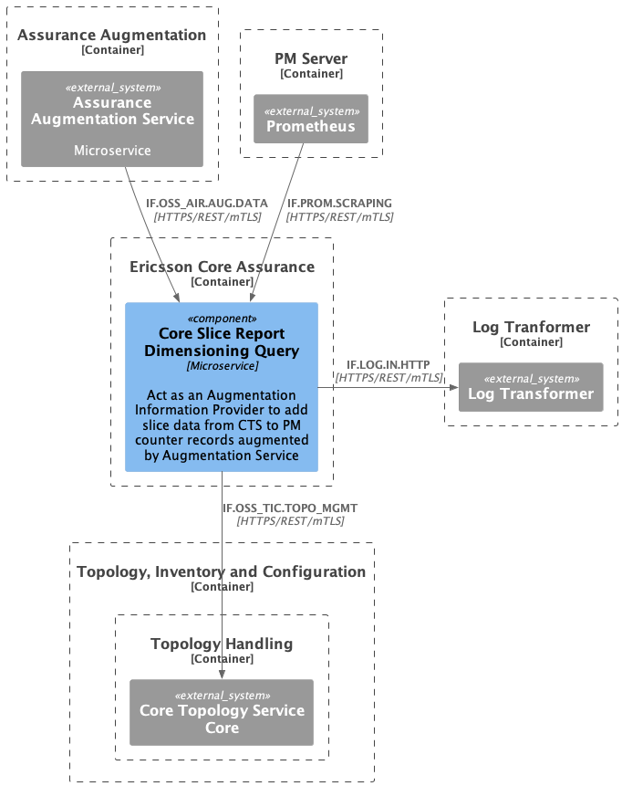
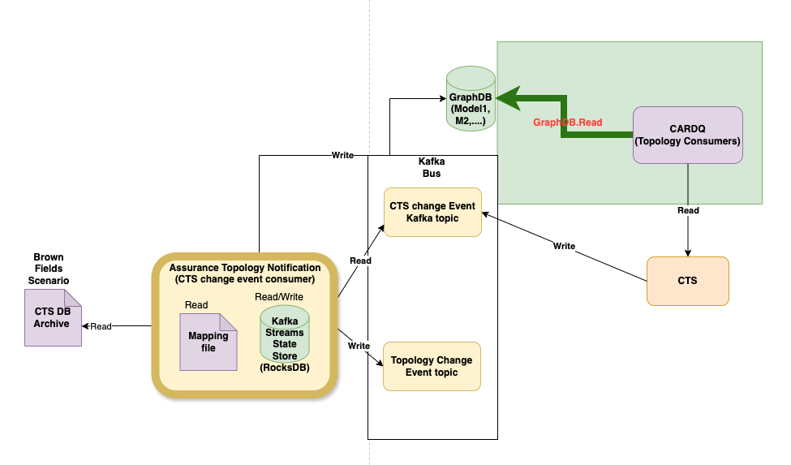
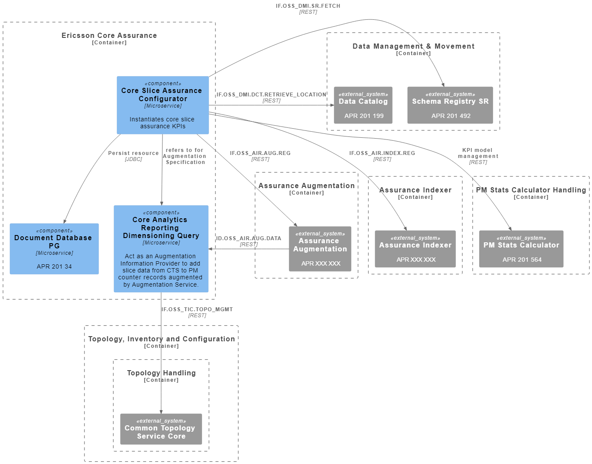

<!--Document information:
Prepared:Umang Patel
Approved:***
Document Name:user-guide
Revision: {!.bob/var.user-guide-version!}
Date: {!.bob/var.date!}
-->

# *Core Analytics Reporting Dimensioning Query* User Guide

[TOC]

## Overview

This user guide gives a brief description of the main features and interfaces of the Core Analytics Reporting Dimensioning Query (CARDQ) microservice.

### Revision History

| Date       | Revision | Comment                                                                   | Author  |
|------------|----------|---------------------------------------------------------------------------|---------|
| 2023-02-01 | 1.0.0    | Initial documentation                                                     | EPTAMUA |
| 2023-07-11 | 1.0.1    | SIP-TLS support                                                           | ZKAUHAR |
| 2023-12-27 | 1.0.2    | Support Aggregation by Site and NSSI without EntityCollection - Core Only | ZSXXVID |
| 2024-01-02 | 1.0.3    | 5G RAN slices                                                             | ZSXXVID |
| 2024-05-16 | 1.0.6    | CARDQ ATH Integration - Part 1                                            | EUNIWLE |

### Description

CARDQ is introduced for the purpose of querying topology information from the Common Topology Service (CTS) to aggregate performance metrics (PM) counters for 5G Core Slices and 5G RAN Slices.

For 5G Core slices, performance metrics counters are aggregated from NSI, NSSI, GeographicSite and PlmnId of the Common Topology Service. 
For 5G RAN slices, performance metrics counters are aggregated from NSI, NSSI, QoS(5QI), NRCell(tac, cellId), PLMNInfo(snssai, plmnId) of the Common Topology Service. 
The existing REST-API includes a "queryType" property to allow the service to distinguish between Core and RAN queries.

CARDQ also has the capability to query topology information from Neo4j database and return the data in the augmentation-info response.

CARDQ acts as an augmentation information provider to add slice data from CTS to PM counter records augmented by the Assurance Augmentation Service
(AAS).

CARDQ supports integration with the following:

 - PM Server to provide metrics
 - The Log Transformer service for supplying logs
 - SIP-TLS to enable cluster-internal secured communication with server and client authentication based on mTLS. This microservice securely 
   communicates with AAS, CTS, Neo4j, PM server and the log transformer using SIP-TLS when their respective TLS setting is enabled.

<!--
### Features

To be written

### Main Concepts

To be written

### Supported Use Cases

This chapter gives an overview of the supported use cases.

| Use Case ID | Use Case Title | Compliance                             |
|-------------|----------------|----------------------------------------|
| <*UC.ID*>   | <*UC Slogan*>  | <*Fully supported or list deviations*> |

### Maturing Features

<*If no Alpha/Beta features are included in the release this chapter can be
omitted*>

This chapter gives an overview of included features still in development. Alpha features are always disabled by default and should only be used for
tests as they are not ready for production use. Alpha features can be removed or changed in future releases without triggering the NBC process.
Beta features that can impact existing functionality are disabled by default and should only be used in production after careful testing. Not all
features have a direct mapping to a Use Case ID.

<*List all features included in the release with Feature Maturity Alpha or Beta. State if they are enabled by default or not. List the related FA
Use Case ID if there is one, if not write N/A*>

| Feature Slogan     | Feature Maturity | Enabled by Default | Related Use Case(s)    |
|--------------------|------------------|--------------------|------------------------|
| <*Feature Slogan*> | <*Alpha, Beta*>  | <*Yes, No*>        | <*Use Case ID or N/A*> |

#### Enabling Maturing Features

<*For each included Alpha/Beta feature add a table explaining how to enable/disable the feature and any new dependencies. If there are no Alpha/Beta
features in the release this chapter can be omitted.*>

<*Feature Slogan*>

<*Optional free text about enabling/disabling the feature*>

| Service | Helm Parameters     |
|---------|---------------------|
| *CARDQ* | <*Helm Parameters*> |

<*Example below, remove before use*>

```
{
Exilis CM integration
Required Helm installation parameters to enable Exilis CM integration

Service | Helm Parameters
---|---
CM Mediator                  | exilis.cm.enabled=true
CM Yang Provider             | newCMArch=true
Exilis CM Backend            | features.cmm_notifications.enabled=true
Exilis Data Transformer JSON | -
}
```
-->

### Architecture

The following diagram shows the *CARDQ* microservice and its architectural context.



Figure 1 Architecture view of *CARDQ*

The following diagram shows the CARDQ architecture with Neo4j enabled.



Figure 2 Architecture view of *CARDQ* with Neo4j context

#### Application Programming Interfaces (APIs)

This section provides an overview of the included APIs and their maturity. APIs with Alpha or Beta maturity should only be used for tests and are not ready
for production use.

| Interface Logical Name | Description                                                                                                                                                                                                                                                                                                                                                                                                             | Interface Maturity |
|------------------------|-------------------------------------------------------------------------------------------------------------------------------------------------------------------------------------------------------------------------------------------------------------------------------------------------------------------------------------------------------------------------------------------------------------------------|--------------------|
| IF.OSS_AIR.AUG.DATA    | This interface is designed to be used by the AAS to augment topology information to PM data related to core network functions (NF) for core slice key performance indicators (KPIs). This API enables us to recognize the list of NSI, NSSI, Geographic Site, and PLMN Id info related to the core NF.<br><br>The secondary purpose of the interface is to return a list of supported augmentation types (RAN or Core). | Alpha              |

### Deployment View

*CARDQ* is packaged as a Docker container. It supports deployment in Kubernetes using Helm.



Figure 3 Deployment view of *CARDQ*

To deploy the microservice, refer to the **Service Deployment Guide**, which:

- Explains how to get started using the *CARDQ* microservice in the supported environments.
- Specifies configuration options for starting the *CARDQ* Docker container.

If problems occur when using the microservice, refer to the **Troubleshooting Guide** section.

### Dimensioning and Characteristics

#### Dimensioning

To handle dimensioning configuration at deployment, refer to the **Service Deployment Guide**.

#### Scaling

| Scaling supported (Yes/No) | Minimum number of instances | Maximum number of recommended instances |
|----------------------------|-----------------------------|-----------------------------------------|
| Yes                        | 1                           | 20                                      |

#### Resilience

*CARDQ* supports scaling and load balancing with Kubernetes.

<!--
#### Upgrade - In Service Software Upgrade

<*Describe how the service supports upgrades, that is how the service fulfills
the ISSU requirement. Describe from a function point of view how ISSU is
supported and what a service unavailability would mean for this particular
service. Do not include practical commands, that is the scope of the Deployment
section*>
-->

#### High Availability

The CARDQ service supports high availability by changing values.yaml:

1. Run multiple instances of microservices which are horizontally scalable (replicaCount default value &ge; 2)
````text
replicaCount may be changed on the command line line for 'helm deploy' or in values.yaml:

    replicaCount: 2
````
2. Set pod anti-affinity rule (default = preferredDuringScheduling,IgnoredDuringExecution or soft)
````text
affinity:
  podAntiAffinity: "soft"
````
3. Support setting of topology spread constraints (default = undefined) via value.yaml to help schedule pods across user defined topologies.
````text
nodeSelector: { }
topologySpreadConstraints:
  deployment: [ ]
  test: [ ]
````
4. Support graceful shutdown in SpringBoot microservices by handling SIGTERM to cleanup pending transactions and resources.
   In order to support graceful shutdown, we have updated applications.yaml file.
````text
#Graceful shutdown
server:
  shutdown: graceful

spring:
  # graceful shutdown wait period for serving in-flight requests
  lifecycle:
    timeout-per-shutdown-phase: ${GRACEFUL_SHUTDOWN_TIMEOUT:30s}
````

5. Configure pre-stop hook with terminationGracePeriodSeconds.
````text
terminationGracePeriodSeconds: 30
````
6. QOS config for pod eviction policy due to resource issues on node - Guaranteed, Burstable or BestEffort.
  This is accomplished in spec containers.
````text
status:
    qosclass: Guaranteed
````
7. Configure mandatory health probes - liveness (with appropriate InitialDelaySeconds) and readiness.
````text
probes:
    eric-oss-core-reporting-dimension-query:
        livenessProbe:
            failureThreshold: 3
            initialDelaySeconds: 120
            periodSeconds: 10
            timeoutSeconds: 10
        readinessProbe:
            failureThreshold: 3
            initialDelaySeconds: 60
            periodSeconds: 10
            timeoutSeconds: 10
````

## Deployment

This section describes the operational procedures for how to deploy and upgrade the *CARDQ* microservice in a Kubernetes environment with Helm.
The list of topics covered within this section are :

- Custom resources defined deployment
- Deployment in a Kubernetes environment using Helm
- Configuration parameters
- Service dimensioning

For detailed information, refer to the **Service Deployment Guide**.

## Security Guidelines

<!--
### Operative Tasks

<Describe the operative tasks that are valid for this service (if applicable).>

<If not applicable, state “This service does not include any operative tasks.”>

<Service Ports>
<Following tables are generated from Service Port JSON fragment by means of service-ports tool>

{!fragments/.generated/service_ports.md!}

-->
### Certificates

*CARDQ* uses certificates for System-Internal, TLS-Based Communication only. These certificates are generated by ADP SIP-TLS service, and they are 
managed/renewed by this service. 

No other certificates are used.


### Security Events That Can Be Logged

This service generates log events for:

- startup, shutdown and restart of the service.
- on certificate reloading.

| Event Type                                   | Log Level | Event Log                                                                                                    |
|----------------------------------------------|-----------|--------------------------------------------------------------------------------------------------------------|
| Certificate Reloading Started                | Info      | Trying to reload SSLHostConfig                                                                               |
| Certificate Reloading  Started               | Info      | Reloading protocol with updated keystore and truststore...                                                   |
| Certificate Reloading Successful             | Info      | Successfully reloaded the SSLHostConfig                                                                      |
| Certificate Reloading Starting               | Warn      | Fetching certificate with alias: {trusted certificate alias}                                                 |
| Certificate Reloading Starting               | Warn      | Reloading Neo4jClient                                                                                        |
| Certificate Reloading Started                | Warn      | Destroyed existing Neo4jClient                                                                               |
| Certificate Reloading Started                | Warn      | Creating new Neo4jClient                                                                                     |
| Certificate Reloading Completed              | Warn      | Registered new Neo4jClient                                                                                   |
| Failed to Create ClientHttpRequestFactory    | Error     | Error while preparing ClientHttpRequestFactory: {Exception}                                                  | 
| Failure on Keystore/Truststore generation    | Error     | Keystore/Truststore generation failed due to :: {Exception}                                                  |
| Failure on Certificate Reloading             | Error     | Cannot reset the SSLHostConfigCertificate. Server has to be restarted for certificate changes :: {Exception} |
| Failure on Certificate Reloading             | Error     | Failed to process TlsContext, skipping the signal {context}, due to {Exception}                              |
| Connectivity Failure between CARDQ and Neo4j | Error     | Neo4j request failed {exception}                                                                             |

*Note: These Errors would not cause the application to crash. However, upon receiving a request with invalid certificates, application would not
work.*

## Privacy User Guidelines
The microservice does not collect, store or process personal data on its own.
> **PTI = 0**

## Performance Management

### Cache

For the *CARDQ* microservice, the following are the default values for the cache configuration:

```yaml
expiryTimeSeconds: 900
maxEntries: 5000
```

Note that the `maxEntries`value is configurable through Helm arguments.

### Scaling

To manually scale up or down the application, use the following command in the Kubernetes environment:

```shell
kubectl scale deployment eric-oss-core-reporting-dimension-query --replicas=<DESIRED-REPLICAS> --namespace=<K8S-NAMESPACE> 
```

To verify the scaling process, use the following command:

```shell
kubectl describe deployment eric-oss-core-reporting-dimension-query -n <K8S-NAMESPACE>
```

## Troubleshooting

Please check the [Troubleshooting Guide](https://adp.ericsson.se/marketplace/core-analytics-reporting-dimensioning-qu/documentation/latest/additional-documents/troubleshooting-guide) for detailed information on troubleshooting, operation and
maintenance.

## References

* [CARDQ Gerrit Repo](https://gerrit-gamma.gic.ericsson.se/#/admin/projects/OSS/com.ericsson.oss.air/eric-oss-core-reporting-dimension-query)
